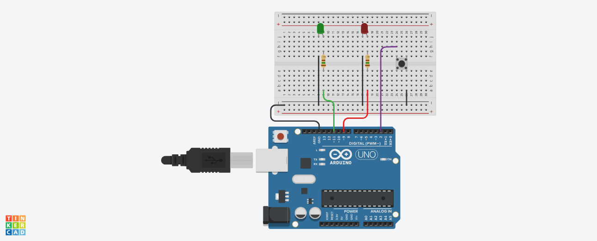

## 📝 Descrição

Esse mini projeto sinaliza a aprovação (LED verde acende) ou reprovação (LED vermelho acende) de um estudante com base em quatro notas enviadas através do monitor serial.

| [Simulação - TinkerCad]() |
:--:
|  |

